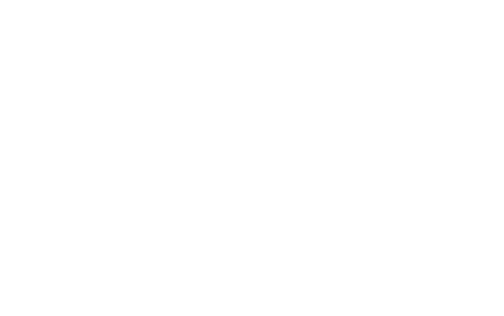

[![LinkedIn][linkedin-shield]][linkedin-url]

<!-- PROJECT LOGO -->
 

  

  <h3 align="center">Snake! FPGA Game</h3>

  

    FPGA snake game with Verilog and FPGA board Altera DE2i-150 board with VGA monitor 
     
    <!--<a href="https://github.com/github_username/repo_name">View Demo</a>-->
  

<!-- TABLE OF CONTENTS -->

  
<h2 style="display: inline-block">Table of Contents</h2>

  <ol>
    <li><a href="#About The Project">About The Project</a></li>
    <li><a href="#Project Requirements">Project Requirements</a></li>
    <li><a href="#Design Diagram">Design Diagram</a></li>
    <li><a href="#Random Grid"> Random Grid</a></li>
    <li><a href="#Collision">Collision</a></li>
    <li><a href="#Implemet">Implemet</a>
	<ul>
        <li><a href="#Struct ">Struct</a></li>
        <li><a href="#The snake algorithm">The snake algorithm</a></li>
		<li><a href="#The ball algorithm">The ball algorithm</a></li>
		<li><a href="#The appe algorithm">The appe algorithm</a></li>
		<li><a href="#Collision algorithm">Collision algorithm</a></li>
      </ul>
	  </li>
    <li><a href="#Evalution">Evalution</a></li>
	<li><a href="#Contact">Contact</a></li>
  </ol>

<!-- ABOUT THE PROJECT -->
## About The Project

From idea of snake game in 80 centery and ping pong game in same time, i using the FPGA board Altera DE2i-150 board and Verilog languade to making this project. All kind of aspect of project will be present in next section. In this project i create the mix between Ping Pong and Snake:

And the result is:

Controls a snake to eat items The longer, the harder to control When the head of a snake collides with its own body or the borders, you lose

## Project Requirements

* Altera DE2i-150 board
* VGA cable and monitor 
* USB cable to upload program to the board 
* Power cable for board 
* Quartus II Software 

## Design Diagram

From design of FPGA project, This is the top module which takes input from controller, clock and start button and is interconnected to all the other modules. This module implements the game logic and gives the output to the VGA monitor driving circuit.

## Control Input

This module is responsible for controlling the input to the main unit. As needed to attach a 4 output controller to the game, this module handles the input to move the "snake" in specified direction.

The snake grows around 4 extra body sizes when it eats an apple, rather than the classic 1. This is to make the game faster paced.

To reset the game, the first switch is used.

The maximum snake length is 127 body parts plus a head (so 128 total parts).

## Random Grid

Generate a random position for the item to be placed on the screen => use "random Grid" module to randomly select a location for the item to appear.

## Collision

A collision is detected by checking if the snake and another object are being drawn on the VGA at the same time (checking if their coordinates are the same). Lethal collisions consist of the snake colliding with its own body, and non-lethal collisions occur when the snake hits an apple, in which case the size of the snake is increased.

## Implemet

* Struct 

* The snake algorithm

When the game starts, the array X (Y) of “snake” from 127th element to 1st element. 
If count <= size – 1, element “count” will receive value X (Y) of element “count – 1”
Direction algorithm
If direction = 4’b0010, turn left
If direction = 4’b1000, turn right
If direction = 4’b0001, turn down
If direction = 4’b0100, turn up

* The ball algorithm

If movement = 0, ball move in NE direction.
If movement = 1, ball move in SE direction
If movement = 2, ball move in SW direction
If movement = 3, ball move in NW direction 

* The appe algorithm

If snake eats apple, the new apple will be created at random position.
If the start = LOW, the new apple will be created at random position
If the start = HIGH, the new apple will be created at random position

* Collision algorithm

Lethal will be borders or snake’s body. Non-lethal will be apples
When receiving posedge of VGA clock: 
If snake head collide non-lethal then size of snake increase 1 and snake eat apple = 1. If start = LOW then size of snake = 1. 
If snake’s head or snake body collide lethal or ball then bad collision = HIGH
If bad collision = HIGH, then Game over.

## Evalution

## Contact

Hieu Nguyen - [Linkedin](https://www.linkedin.com/in/hieunguyen-dev/)

Linkedin: https://www.linkedin.com/in/hieunguyen-dev/
Email: hnhieu979@gmail.com
Phone: 0927931496
Facebook: https://www.facebook.com/hieu.nguyenmixed

Project Link: [https://github.com/HieuNguyenHuu/fpga_snakegame](https://github.com/HieuNguyenHuu/fpga_snakegame)

[linkedin-shield]: https://img.shields.io/badge/-LinkedIn-black.svg?style=for-the-badge&logo=linkedin&colorB=555
[linkedin-url]: https://www.linkedin.com/in/hieunguyen-dev/

